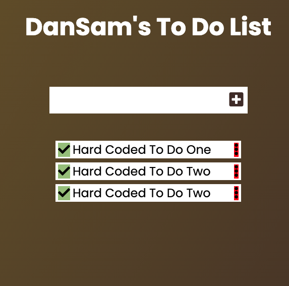

# To Do list

"To-do list" is a tool that helps to organize your day. It simply lists the things that you need to do and allows you to mark them as complete. I built a simple website that allows for doing that, using ES6 and Webpack!

I've been able to use Webpack to manage the files for front-end, using loaders for HTML, CSS and JavaScript files, in order to fix some special thing at the moment to use the front-end in a server.

This simple application allow user perform full basic CRUD operation using the local storage.

## Built With 🔨

- JavaScript
- HTML
- CSS
- Webpack
- Local Storage
- Visual Studio Code
- Git & Github
## Live Demo

[Live Demo Link](https://dansam5k.github.io/To-Do-List/)
## Getting Started

👤 **Daniel Samuel**

- Github: [DanSam5k](https://github.com/DanSam5k)
- Twitter: [@_dan_sam](https://twitter.com/_dan_sam)
- Linkedin: [dansamuel](https://www.linkedin.com/in/dansamuel/)

### Install

To get a local copy up and running follow these simple example steps.
- Open terminal
- Clone this project by the command `git clone https://github.com/DanSam5K/To-Do-List.git`
- `cd <clone>` folder
- Run `npm start` in your local browser or using Live Server in Visual Studio Code.

### Prerequisites

- IDE to edit and run the code (We use Visual Studio Code 🔥).
- [Node.js](https://nodejs.org/en/download/) already downloaded.
- Webpack - [click here to getting started](https://webpack.js.org/guides/getting-started/).

### Usage

- For anyone who wants to practice Webpack skills.
- How to manage your front-end files using Webpack.

## 🤝 Contributing

Contributions, issues, and feature requests are welcome!

Feel free to check the [issues page](https://github.com/DanSam5K/To-Do-List/issues).

## Show your support

Give a ⭐️ if you like this project!

## Acknowledgments

- Hat tip to anyone whose code was used 🔰
- Inspiration 💘
- Microverse program ⚡
- Our standup team 🏹
- Our family's support 🙌

## 📝 License

This project is [MIT](./LICENSE) licensed.
